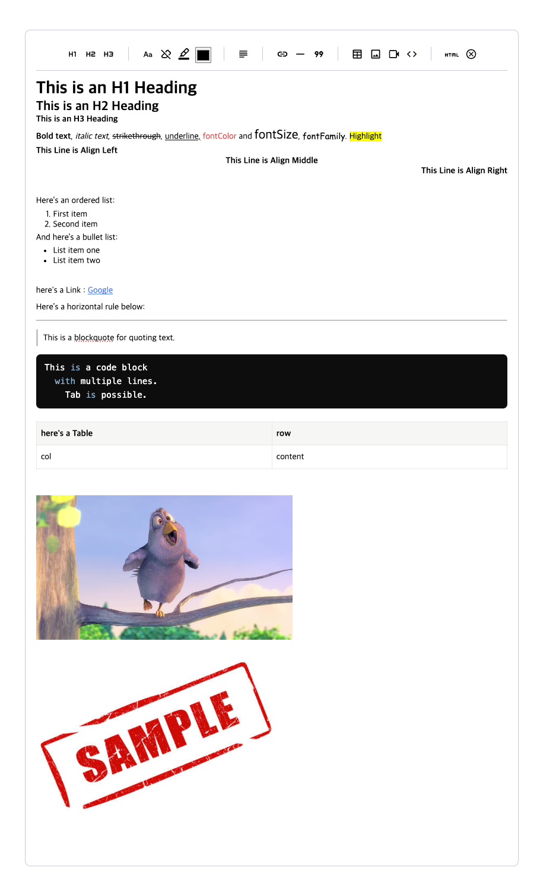
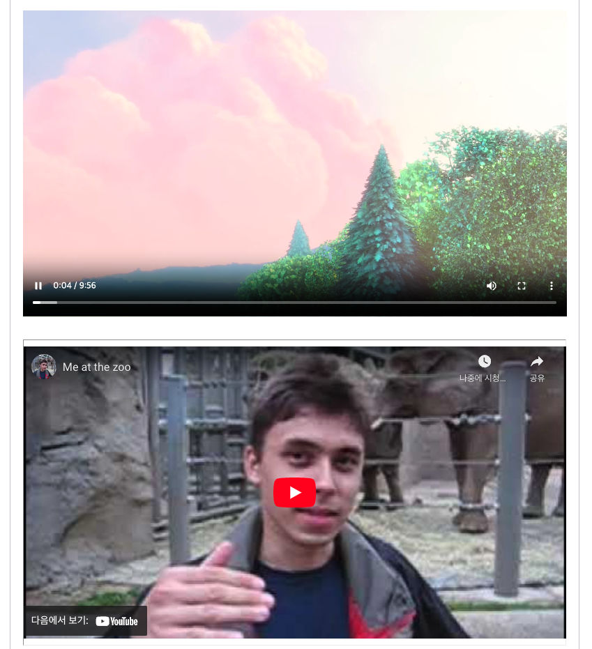
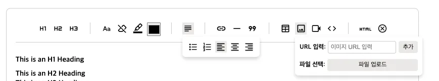
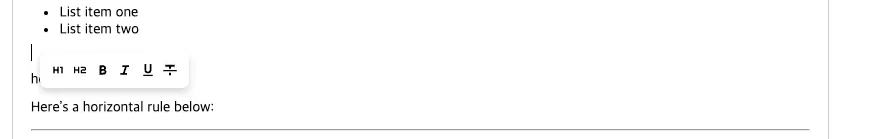

# tiptap-full-feature

---

소개         Tiptap 기본 기능 + Custom 기능 구현

기술          `React`  `TypeScript`

구성          본인

일정          2024.10 ~ 2024.10

<aside>
💡 Headless WYSIWYG 인 Tiptap 에 기본 CSS를 추가하고 모든 기본 기능 + Custom 기능 구현을 한 React 프로젝트입니다.
</aside>

깃허브

- [https://github.com/rodminjo/tiptap-full-feature](https://github.com/rodminjo/tiptap-full-feature)

## 📖 구현 동기

---

- React 프로젝트에서 사용자가 사용할 WYSIWYG 를 구현
- Headless WYSIWYG 이기에 기본 CSS와 기능을 만들어 지속적으로 사용하고자 함

## 📋 목표

---

### 기능 관점

1. 기존에 사용하는 WYSIWYG 에 존재하는 모든 기능 구현
2. Tiptap에서 제공하는 모든 기능 구현
3. Video 태그 삽입, 반응형을 위한 동영상 넓이 설정 등 커스텀 기능 구현
4. 지속적으로 사용할 수 있는 CSS 추가

### 기술 관점

1. 각 버튼을 컴포넌트화 하여 커스텀이 쉬운 방향으로 구현
2. 플로팅메뉴, 버블메뉴를 상황마다 변경되도록 구현

## **📚 서비스 소개**

---



### 구현 기능

✅ **서식 및 텍스트**

- 제목 스타일: H1, H2, H3
- 텍스트 서식 옵션: 볼드체(Bold), 이탤릭체(Italic), 취소선(Strikethrough), 밑줄(Underline)
- 글자 색상(Font Color), 글자 크기(Font Size), 글꼴(Font Family) 지정
- 하이라이트(Highlight) 기능

✅ **텍스트 정렬**

- 텍스트 정렬 옵션: 좌측 정렬, 가운데 정렬, 우측 정렬

✅ **목록 및 링크**

- 순서 있는 리스트(Ordered List)
- 순서 없는 리스트(Bullet List)
- 드래그해서 링크 추가(Link)

✅ **레이아웃 및 구조**

- 수평선(Horizontal Rule) 추가
- 인용구(Blockquote) 추가

✅ **코드 및 테이블**

- 코드 블록(Code Block) 추가 (**```언어명 + Enter**)
- 탭(Tab) 입력 가능
- 코드블록 컬러 버전 구현
- 테이블(Table) 생성

✅ 설정 초기화 및 HTML 모드

- 설정 초기화 기능
- HTML로 변환하여 editing 가능

✅ 이미지 삽입

- 이미지 파일, URL 삽입 가능

✅Video, 유튜브 삽입

- Youtube, video 링크 구분하여 삽입



✅ 플로팅 메뉴, 버블 메뉴, 툴바

- 툴바 구현



- 플로팅, 버블메뉴 구현



## 🛠️ 기술

---

### 구현 기술

✅ tiptap 기본 extension

- Link : 링크 삽입 및 편집 기능.
- StarterKit : Tiptap의 기본 기능(H1~H3, Bold, Italic, Bullet List, Ordered List 등) 지원.
- Underline : 텍스트 밑줄 기능.
- Color : 텍스트 색상 변경 기능.
- Hightlight : 텍스트 하이라이트(배경 강조) 기능.
- TextAlign : 텍스트 정렬(좌측, 중앙, 우측).
- FontFamily : 텍스트의 글꼴(Font Family) 설정.
- Table :  테이블 생성 및 관리.
- Image : 이미지 삽입 및 속성 관리.
- Youtube : YouTube 동영상 삽입 및 속성 제어.

✅ tiptap 외부 extension

- CustomCodeBlockLowlight : 코드 블록 추가 및 문법 강조(Lowlight 사용).

✅ tiptap 직접 구현 extension

- Video : Video 태그 생성 ([tiptap-basic-video](https://www.npmjs.com/package/tiptap-basic-video) : 직접 구현하여 라이브러리로 배포하였습니다.)
- FontSize : 폰트 크기
- Indent : 들여쓰기

### 라이브러리


✅ **Tiptap 확장 및 기본 기능**

- `@tiptap/extension-blockquote`
- `@tiptap/extension-code-block-lowlight`
- `@tiptap/extension-color`
- `@tiptap/extension-dropcursor`
- `@tiptap/extension-font-family`
- `@tiptap/extension-gapcursor`
- `@tiptap/extension-highlight`
- `@tiptap/extension-image`
- `@tiptap/extension-link`
- `@tiptap/extension-table`
- `@tiptap/extension-table-cell`
- `@tiptap/extension-table-header`
- `@tiptap/extension-table-row`
- `@tiptap/extension-text-align`
- `@tiptap/extension-text-style`
- `@tiptap/extension-underline`
- `@tiptap/extension-youtube`
- `@tiptap/html`
- `@tiptap/starter-kit`
- `@tiptap/react`

✅ **유틸리티 및 React 관련**

- `@tiptap/pm`: ProseMirror의 기능 확장 및 활용을 위한 패키지.
- `react`, `react-dom`: React 라이브러리 및 DOM 렌더링 지원.
- `react-router-dom`: React를 위한 라우팅 기능.

✅ **타입스크립트 및 개발 환경**

- `@types/jest`, `@types/node`, `@types/react`, `@types/react-dom`: 각종 타입스크립트 타입 정의 지원.
- `typescript`: 타입스크립트 개발 환경 구축.
- `tiptap-markdown`: Tiptap의 Markdown 변환 및 지원 기능.
- `sass`: Sass(CSS 전처리기) 지원.
- `react-scripts`: React 앱 개발 환경 제공(Create React App 기반).
- `web-vitals`: 웹 성능 측정 도구.